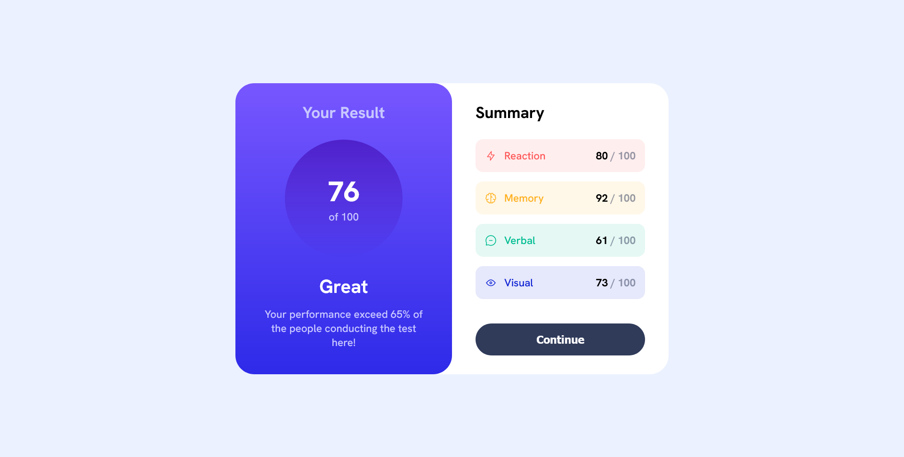
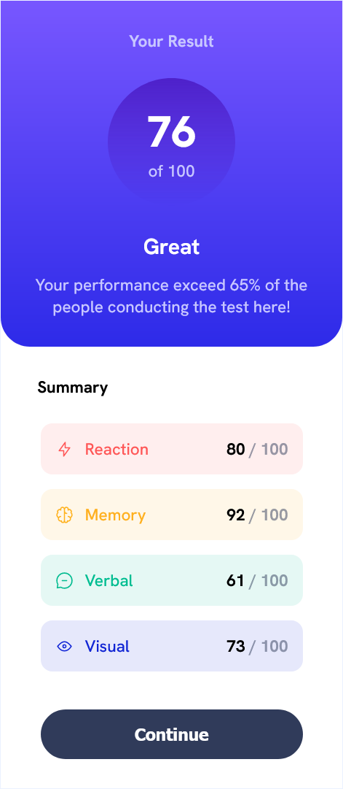

# Frontend Mentor - Result Summary Component
This Project is made to complete the challenge [Result Summary Component](https://www.frontendmentor.io/challenges/results-summary-component-CE_K6s0ma) from Frontend Mentor.
## Table of Contents
- [Overview](#overview)
  - [Challenge](#challenge)
  - [Screenshot](#screenshot)
- [My Process](#my-process)
  - [Built with](#built-with)
  - [What I Learned](#what-i-learned)
  - [Useful Resources](useful-resources)
- [Author](#author)

## Overview
This is a mini challenge created by Frontend Mentor to build a responsive Result-Summary component using HTML and CSS. This Component presents
data about participant's body performance which is evaluates by their Reaction, Memory, Verbal 
and Visual skill. Each of this skill is scored and will be sumed up to get the final result.

### Challenge
In order to complete this challenge, user should be able to :
1. View the optimal layout for the interface depending on their device's screen size
2. See hover and focus states for all interactive elements on the page

### Screenshot
**Desktop Preview**

**Mobile Preview**

## My Process
### Built With
- Semantic HTML5 Markup
- CSS Custom Properties
- Flexbox
- CSS Grid
- Desktop-first Workflow

### What I learned
In the process of accomplishing this project, I learned :
- Backtrack in Git
- Git Branching
- Markdown Syntax

### Useful Resources
- [Basic Markdown](https://www.markdownguide.org/basic-syntax/) - This Website presents complete basic markdown syntax and its best practices on how to write proper markdown.
- [Git Branching](https://www.codecademy.com/journeys/full-stack-engineer/paths/fscj-22-front-end-development/tracks/fscj-22-git-and-github-part-ii/modules/wdcp-22-git-branching-fb427e84-b1d4-439b-ade9-cb528c092fdd/lessons/git-branching/exercises/branch-review) - This is an useful lesson from Codecademy which helps me alot on about git branching syntax and how to use it in projects.
- [Git Backtracking](https://www.codecademy.com/journeys/full-stack-engineer/paths/fscj-22-building-interactive-websites/tracks/fscj-22-git-and-github-part-i/modules/wdcp-22-important-git-operations-da30bb5a-8cd0-4294-b963-9841dd1c22db/lessons/git-backtracking) - Another useful lesson from Codecademy that teach me how to backtracking our project version.

## Author
- Frontend Mentor - [@Biggboss7](frontendmentor.io/profile/Biggboss7)
- Github - [Biggboss7](https://github.com/Biggboss7)
